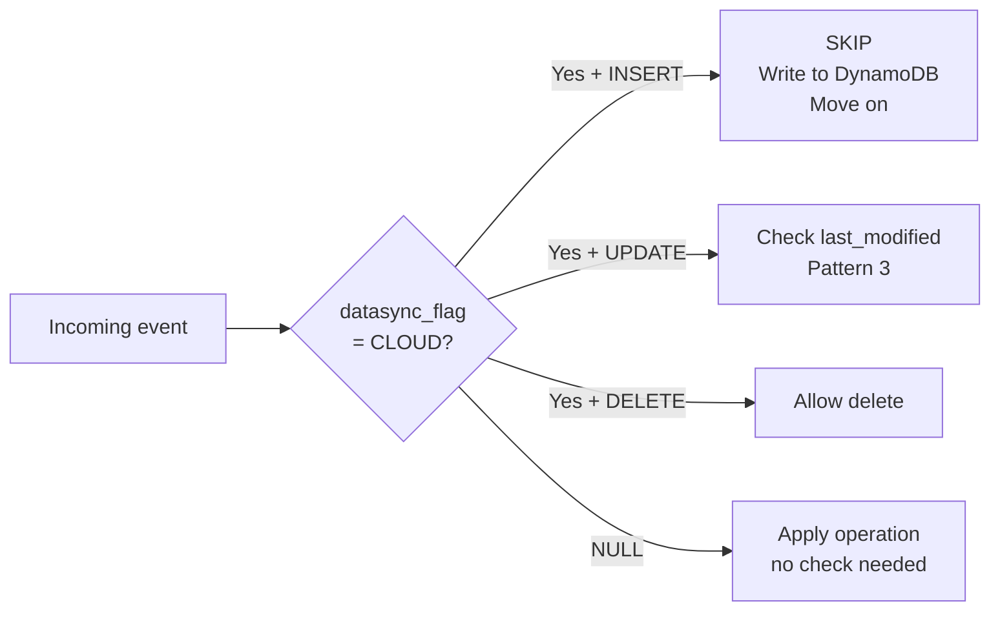
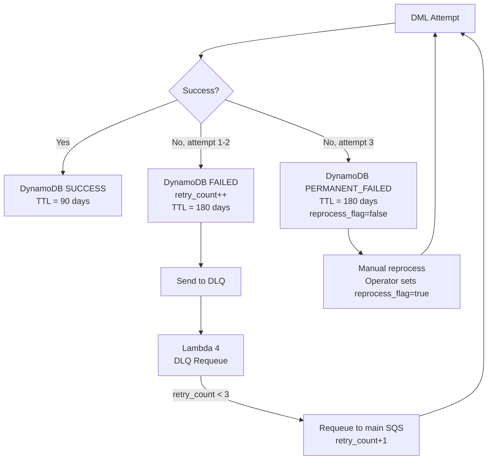

# LDCF Eight Integrity Patterns

> Complete reference for all eight original patterns in the framework.
> Each pattern solves a specific production problem encountered during
> enterprise legacy modernization.

---

## Pattern 1 — Dual-Sequence Key Partitioning

**Problem:** When both legacy and cloud systems insert records independently,
integer primary keys collide.

**Solution:** Legacy sequences use EVEN numbers. Cloud sequences use ODD numbers.
The origin of any record is permanently identifiable from its PK value alone.

```
Legacy MySQL:  AUTO_INCREMENT starts at 1000000 (EVEN)
               1000000, 1000002, 1000004 ...

Aurora Cloud:  SEQUENCE starts at 1000001 (ODD), INCREMENT 2
               1000001, 1000003, 1000005 ...
```

**Result:** Zero PK collisions. No coordination required between systems.

---

## Pattern 2 — Origin-Aware Circular Replication Guard

**Problem:** In bidirectional sync, a record written by the cloud system
gets replicated back to the cloud — creating an infinite loop.

**Solution:** Every table has a `datasync_flag` column. Cloud writes set
`datasync_flag = 'CLOUD'`. The upstream loader checks this flag:



---

## Pattern 3 — Last-Write-Wins Conflict Resolution

**Problem:** A cloud UPDATE arriving after a later legacy UPDATE would
overwrite a newer record with stale data.

**Solution:** When `datasync_flag = CLOUD` and operation is UPDATE,
compare incoming `last_modified` against the current target record.
Apply only if incoming timestamp is equal or newer.

```
Incoming event last_modified:  2026-06-15 14:30:22
Existing record last_modified: 2026-06-15 14:31:00

Result: SKIP — existing record is newer
```

---

## Pattern 4 — Upsert Tolerance for Out-of-Order Events

**Problem:** CDC events can arrive out of order due to network delays or
batch processing. A duplicate INSERT causes a primary key violation.

**Solution:** All INSERTs use `INSERT ON CONFLICT DO UPDATE` (PostgreSQL upsert).
Duplicate events are handled gracefully — the later event updates the record.

```sql
INSERT INTO insurance.claim (legacy_claim_id, claim_num, ...)
VALUES (%s, %s, ...)
ON CONFLICT (legacy_claim_id)
DO UPDATE SET
    claim_status  = EXCLUDED.claim_status,
    claim_amount  = EXCLUDED.claim_amount,
    last_modified = NOW()
```

---

## Pattern 5 — Three-Tier DLQ with Tiered Audit Persistence

**Problem:** A failed DML has no recovery path and no audit trail.

**Solution:** Three-tier retry with DynamoDB audit at every stage.



**DynamoDB stores both `event_metadata` and `event_data`** — everything
needed to reprocess any failed event without re-fetching from S3.

---

## Pattern 6 — Binary Key Bridging

**Problem:** Mainframe z/OS uses 9-byte STCK (Store Clock) binary timestamps
as record keys. These cannot be stored in standard VARCHAR columns.

**Solution:** Qlik Replicate encodes the 9-byte binary as an 18-character
hexadecimal string. The cloud schema stores the hex string as the legacy key.

```
STCK binary:  0xC7F3A2B1D4E5F601  (9 bytes)
Hex encoded:  C7F3A2B1D4E5F601    (18 chars VARCHAR)
```

The encoding is lossless and reversible — the original binary key can be
reconstructed from the hex string for any legacy system lookup.

---

## Pattern 7 — Metadata-Driven 1-to-Many Schema Decomposition

**Problem:** Standard CDC tools assume source schema = target schema.
Legacy systems often have wide denormalized tables that must be split
into multiple modern normalized tables.

**Solution:** The metadata engine holds 1-to-many table mappings.
One source table event triggers inserts into multiple target tables.
All SQL is generated dynamically — no hardcoded column names anywhere.

```
Legacy CLAIM table (1 row)
    │
    ├── → insurance.claim          (map_id=3, load_order=1)
    └── → insurance.claim_keyring  (map_id=4, load_order=2)
         └── UUID generated by PostgreSQL gen_random_uuid()
```

The `load_order` column ensures parent records are always inserted
before child records.

---

## Pattern 8 — Eventual Consistency with Bounded Drift

**Problem:** In distributed systems, perfect consistency is impossible.
But unbounded eventual consistency means data drift is never resolved.

**Solution:** Each DML is an independent transaction. Failure of one
does not block others. The daily AWS Glue reconciliation job provides
a hard upper bound on undetected drift.

```
Drift guarantee:
  Any missing or inconsistent record is detected within 24 hours
  by the Glue reconciliation job and automatically reprocessed.

Failure isolation:
  INSERT into insurance.claim   → SUCCESS
  INSERT into insurance.claim_keyring → PERMANENT_FAILED
  
  Result: claim exists, claim_keyring missing
  Glue detects this within 24 hours
  Lambda reprocesses claim_keyring insert only
```

**The coexistence period has a mathematically bounded maximum drift window.**
