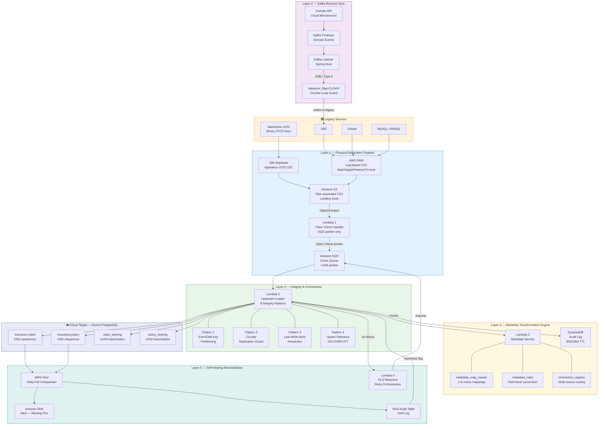

# LDCF Five-Layer Architecture Diagram

> Mermaid diagram — renders in GitHub automatically

---

## Layer Responsibilities Summary

| Layer | Name | Primary AWS Services |
|-------|------|---------------------|
| 1 | Physical Replication Pipeline | AWS DMS, Amazon S3, AWS Lambda, Amazon SQS |
| 2 | Integrity & Correctness | AWS Lambda, Amazon SQS DLQ |
| 3 | Metadata Transformation | AWS Lambda, Amazon Aurora, Amazon DynamoDB |
| 4 | Kafka Reverse Sync | Amazon MSK, Spring Boot on ECS/EC2 |
| 5 | Self-Healing Reconciliation | AWS Glue, Amazon SNS, Amazon RDS, AWS Lambda |
